# Hockey Database Diagram

This diagram shows the database structure for the hockey application based on Django models.

```mermaid
erDiagram
    %% Core Reference Tables
    TeamLevel {
        int id PK
        varchar name
    }
    
    Division {
        int id PK
        varchar name
    }
    
    Season {
        int id PK
        varchar name UK
        date start_date
    }
    
    PlayerPosition {
        int id PK
        varchar name
    }
    
    GameType {
        int id PK
        varchar name
    }
    
    GamePeriod {
        int id PK
        varchar name
    }
    
    Arena {
        int id PK
        varchar name
        text address
    }
    
    ArenaRink {
        int id PK
        varchar name
        int arena_id FK
    }
    
    %% Main Entity Tables
    Team {
        int id PK
        varchar age_group
        int level_id FK
        int division_id FK
        varchar name
        image logo
        varchar city
    }
    
    Player {
        int id PK
        varchar first_name
        varchar last_name
        date birth_year
        text player_bio
        varchar birthplace_country
        varchar address_country
        varchar address_region
        varchar address_city
        text address_street
        varchar address_postal_code
        int height
        int weight
        varchar shoots
        int team_id FK
        int position_id FK
        int number
        image photo
        text analysis
        int shots_on_goal
        int games_played
        int goals
        int assists
        int scoring_chances
        int blocked_shots
        duration penalties_drawn
        duration penalty_minutes
        int power_play_goals_diff
        int penalty_kill_diff
        int five_on_five_diff
        int overall_diff
        int short_handed_goals
        int power_play_goals
        int faceoffs
        int faceoffs_won
        int turnovers
        float faceoff_win_percents
        float shots_on_goal_per_game
        int points
    }
    
    Goalie {
        int id PK
        varchar first_name
        varchar last_name
        date birth_year
        text player_bio
        varchar birthplace_country
        varchar address_country
        varchar address_region
        varchar address_city
        text address_street
        varchar address_postal_code
        int height
        int weight
        varchar shoots
        int team_id FK
        int jersey_number
        image photo
        text analysis
        int saves_above_avg
        int shots_on_goal
        int saves
        int goals_against
        int games_played
        int wins
        int losses
        int goals
        int assists
        duration penalty_minutes
        int short_handed_goals_against
        int power_play_goals_against
        float save_percents
        float shots_on_goal_per_game
        int points
    }
    
    %% Season Statistics Tables
    TeamSeason {
        int id PK
        int team_id FK
        int season_id FK
        int games_played
        int goals_for
        int goals_against
        int wins
        int losses
        int ties
    }
    
    PlayerSeason {
        int id PK
        int player_id FK
        int season_id FK
        int shots_on_goal
        int games_played
        int goals
        int assists
        int scoring_chances
        int blocked_shots
        duration penalties_drawn
        duration penalty_minutes
        int power_play_goals_diff
        int penalty_kill_diff
        int five_on_five_diff
        int overall_diff
        int short_handed_goals
        int power_play_goals
        int faceoffs
        int faceoffs_won
        int turnovers
        float faceoff_win_percents
        float shots_on_goal_per_game
        int points
    }
    
    GoalieSeason {
        int id PK
        int goalie_id FK
        int season_id FK
        int shots_on_goal
        int saves
        int goals_against
        int games_played
        int wins
        int losses
        int goals
        int assists
        duration penalty_minutes
        int short_handed_goals_against
        int power_play_goals_against
        float save_percents
        float shots_on_goal_per_game
        int points
    }
    
    %% Transaction Tables
    PlayerTransaction {
        int id PK
        int player_id FK
        int season_id FK
        date date
        int team_id FK
        int number
        text description
    }
    
    GoalieTransaction {
        int id PK
        int goalie_id FK
        int season_id FK
        date date
        int team_id FK
        int number
        text description
    }
    
    %% Game Analysis Tables
    DefensiveZoneExit {
        int id PK
        int icing
        int skate_out
        int so_win
        int so_lose
        int passes
    }
    
    OffensiveZoneEntry {
        int id PK
        int pass_in
        int dump_win
        int dump_lose
        int skate_in
    }
    
    Shots {
        int id PK
        int shots_on_goal
        int missed_net
        int scoring_chance
        int blocked
    }
    
    Turnovers {
        int id PK
        int off_zone
        int neutral_zone
        int def_zone
    }
    
    %% Game Tables
    Game {
        int id PK
        int home_team_id FK
        int home_goals
        int home_team_goalie_id FK
        int away_team_id FK
        int away_goals
        int away_team_goalie_id FK
        int game_type_id FK
        varchar tournament_name
        int status
        int season_id FK
        date date
        time time
        int rink_id FK
        int game_period_id FK
        varchar game_type_group
        int home_faceoff_win
        int home_defensive_zone_exit_id FK
        int home_offensive_zone_entry_id FK
        int home_shots_id FK
        int home_turnovers_id FK
        int away_faceoff_win
        int away_defensive_zone_exit_id FK
        int away_offensive_zone_entry_id FK
        int away_shots_id FK
        int away_turnovers_id FK
        boolean is_deprecated
    }
    
    GamePlayer {
        int id PK
        int game_id FK
        int player_id FK
        int goals
        int assists
        int shots_on_goal
        int scoring_chances
        duration penalty_minutes
        int turnovers
        int faceoffs
        int points
    }
    
    GameGoalie {
        int id PK
        int game_id FK
        int goalie_id FK
        int goals_against
        int saves
        int shots_against
        float save_percents
    }
    
    GameEventName {
        int id PK
        varchar name
    }
    
    GameEvents {
        int id PK
        int game_id FK
        int number
        int event_name_id FK
        time time
        int period_id FK
        int team_id FK
        int player_id FK
        int player_2_id FK
        int goalie_id FK
        int ice_top_offset
        int ice_left_offset
        int net_top_offset
        int net_left_offset
        varchar youtube_link
        text note
        duration time_length
        boolean is_faceoff_won
        boolean is_deprecated
    }
    
    GameEventsAnalysisQueue {
        uuid id PK
        int game_event_id FK
        int game_id FK
        datetime date_time
        int action
        text error_message
    }
    
    HighlightReel {
        int id PK
        varchar name
        text description
        date date
        int created_by
    }
    
    %% Relationships
    TeamLevel ||--o{ Team : "has level"
    Division ||--o{ Team : "belongs to"
    Team ||--o{ Player : "has players"
    Team ||--o{ Goalie : "has goalies"
    PlayerPosition ||--o{ Player : "has position"
    
    Team ||--o{ TeamSeason : "has seasons"
    Season ||--o{ TeamSeason : "has teams"
    Player ||--o{ PlayerSeason : "has seasons"
    Season ||--o{ PlayerSeason : "has players"
    Goalie ||--o{ GoalieSeason : "has seasons"
    Season ||--o{ GoalieSeason : "has goalies"
    
    Player ||--o{ PlayerTransaction : "has transactions"
    Season ||--o{ PlayerTransaction : "in season"
    Team ||--o{ PlayerTransaction : "with team"
    Goalie ||--o{ GoalieTransaction : "has transactions"
    Season ||--o{ GoalieTransaction : "in season"
    Team ||--o{ GoalieTransaction : "with team"
    
    Arena ||--o{ ArenaRink : "has rinks"
    ArenaRink ||--o{ Game : "hosts games"
    
    Team ||--o{ Game : "home team"
    Team ||--o{ Game : "away team"
    Goalie ||--o{ Game : "home goalie"
    Goalie ||--o{ Game : "away goalie"
    GameType ||--o{ Game : "has type"
    Season ||--o{ Game : "in season"
    GamePeriod ||--o{ Game : "current period"
    
    DefensiveZoneExit ||--o| Game : "home defensive exit"
    DefensiveZoneExit ||--o| Game : "away defensive exit"
    OffensiveZoneEntry ||--o| Game : "home offensive entry"
    OffensiveZoneEntry ||--o| Game : "away offensive entry"
    Shots ||--o| Game : "home shots"
    Shots ||--o| Game : "away shots"
    Turnovers ||--o| Game : "home turnovers"
    Turnovers ||--o| Game : "away turnovers"
    
    Game ||--o{ GamePlayer : "has players"
    Player ||--o{ GamePlayer : "plays in"
    Game ||--o{ GameGoalie : "has goalies"
    Goalie ||--o{ GameGoalie : "plays in"
    
    Game ||--o{ GameEvents : "has events"
    GameEventName ||--o{ GameEvents : "event type"
    GamePeriod ||--o{ GameEvents : "in period"
    Team ||--o{ GameEvents : "team involved"
    Player ||--o{ GameEvents : "player involved"
    Player ||--o{ GameEvents : "player 2 involved"
    Goalie ||--o{ GameEvents : "goalie involved"
    
    GameEvents ||--o{ GameEventsAnalysisQueue : "queued for analysis"
    Game ||--o{ GameEventsAnalysisQueue : "queued for analysis"
```

## Key Relationships

### Core Entities
- **Team**: Central entity with level, division, and location info
- **Player**: Inherits from PlayerPersonalInformationMixin, belongs to team and position
- **Goalie**: Inherits from PlayerPersonalInformationMixin, belongs to team
- **Season**: Time-based entity for organizing games and statistics

### Game Management
- **Game**: Central game entity linking teams, goalies, arena, and season
- **GamePlayer**: Individual player performance in specific games
- **GameGoalie**: Individual goalie performance in specific games
- **GameEvents**: Detailed event tracking during games

### Statistics Tracking
- **PlayerSeason/GoalieSeason**: Season-level aggregated statistics
- **TeamSeason**: Team performance per season
- **DefensiveZoneExit/OffensiveZoneEntry/Shots/Turnovers**: Game analysis data

### Transaction History
- **PlayerTransaction/GoalieTransaction**: Track player/goalie movements between teams

### Analysis Queue
- **GameEventsAnalysisQueue**: Background processing queue for game event analysis

## Notable Features
- Uses Django's GeneratedField for calculated statistics (save percentages, points, etc.)
- Abstract mixin (PlayerPersonalInformationMixin) for shared player/goalie fields
- OneToOne relationships for game analysis data
- UUID primary key for analysis queue
- Unique constraints on team names and cities

